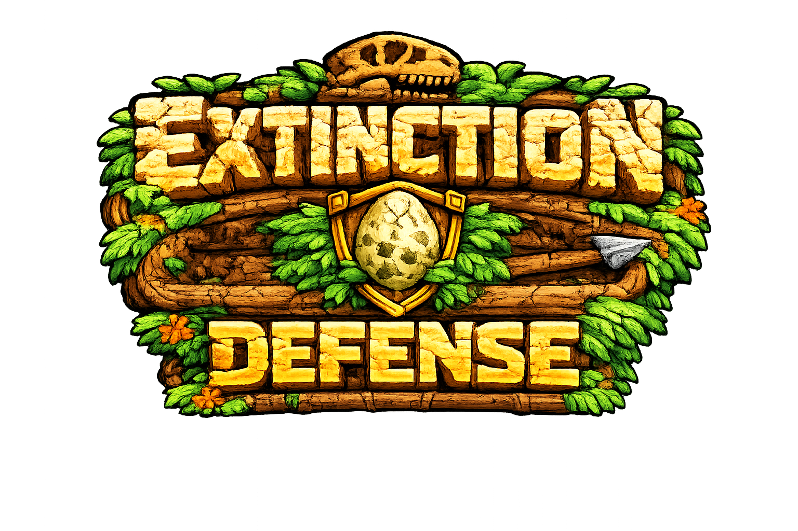
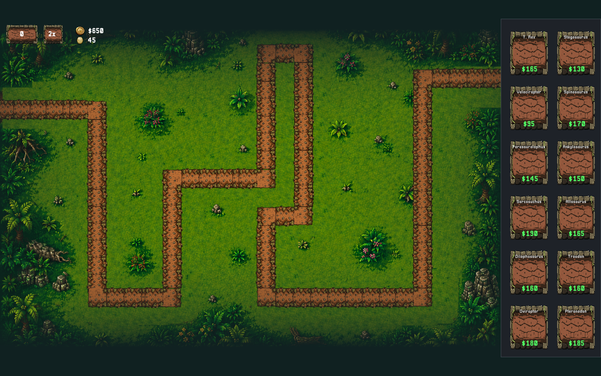
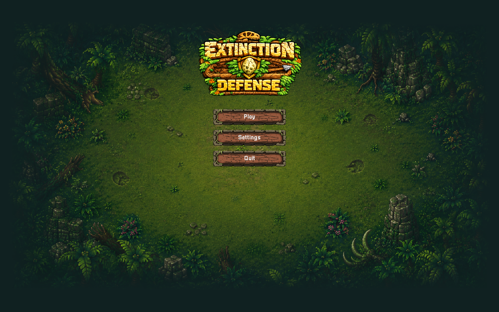
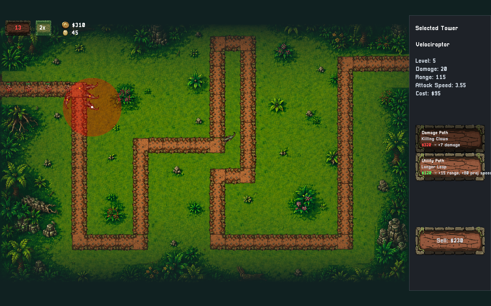
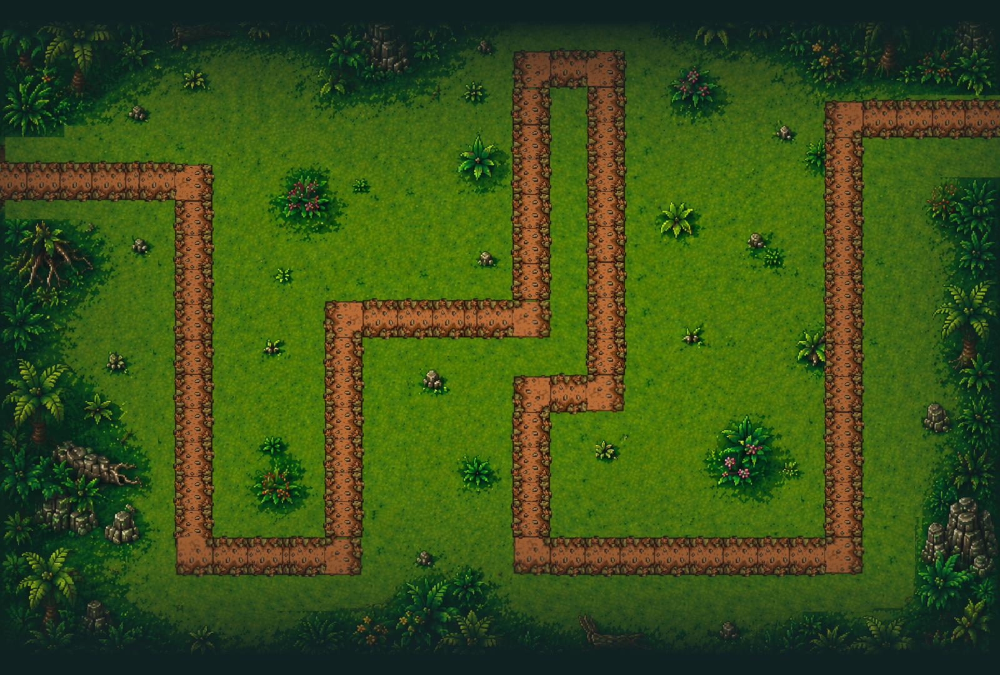

<p align="center">
  
</p>

<p align="center">
  <strong>A cross-platform dinosaur tower-defense game built from scratch in C++ using SDL2.</strong>
</p>

<p align="center">
  120 waves • 12 dinosaur towers • 18 enemy types • Dual upgrade paths
</p>

<p align="center">
  
</p>

## About

**Extinction Defense** is a prehistoric-themed tower-defense game focused on strategic tower placement, varied dinosaur abilities, enemy counterplay, and long-form progression.

The project was built in C++ with SDL2 to deepen my understanding of systems programming, game architecture, real-time application design, and cross-platform development.

## Features

- Full **120-wave progression system** with a designed difficulty curve
- **12 playable dinosaur towers**
- **18 enemy types** with animated 9-frame sprite sheets
- Dual upgrade paths for every tower
- Grid-based placement with variable tower footprints
- Predictive projectile targeting
- Animated projectile rendering
- Single-target, splash, pierce, burst, support, economy, manual-targeting, and reposition mechanics
- Enemy armor, slow resistance, healing, and aura systems
- Main menu, map selection, difficulty selection, pause menu, and settings
- Runtime configuration for fullscreen, resolution, VSync, volume, FPS, and debug/grid display
- 1x and 2x gameplay speeds

## Screenshots

<table>
  <tr>
    <td width="50%">
      
    </td>
    <td width="50%">
      
    </td>
  </tr>
  <tr>
    <td align="center"><strong>Main Menu</strong></td>
    <td align="center"><strong>Tower Management & Upgrades</strong></td>
  </tr>
</table>


## Dinosaur Towers

Each dinosaur fills a different strategic role:

| Tower | Role |
|---|---|
| **T. Rex** | Heavy single-target damage |
| **Stegosaurus** | Reliable ranged attacker |
| **Velociraptor** | High attack speed |
| **Spinosaurus** | Piercing projectiles |
| **Parasaurolophus** | Economy generation |
| **Ankylosaurus** | Slow-on-hit crowd control |
| **Sarcosuchus** | Splash damage |
| **Allosaurus** | Burst attacks |
| **Dilophosaurus** | Attack-speed support aura |
| **Troodon** | Targeting support |
| **Oviraptor** | Manual-target splash artillery |
| **Pteranodon** | Repositionable tower |

## Tech Stack

- **C++**
- **SDL2** — rendering and input
- **SDL2_image**
- **SDL2_ttf**
- **SDL2_mixer**
- **nlohmann/json**
- **CMake**

## Architecture

Extinction Defense is built around modular gameplay systems rather than placing all game logic in a single monolithic loop.

- `TowerDefinition` and `EnemyDefinition` provide static gameplay blueprints.
- Runtime state is stored on placed `Tower` and spawned `Enemy` instances.
- `WaveManager` controls wave progression and enemy spawning.
- `AssetManager` owns textures, fonts, and sounds.
- Centralized combat logic handles damage, armor, slowing effects, rewards, and enemy deaths.
- Projectiles use fixed velocities and predictive aiming.
- Maps are JSON-driven and converted into grid and path data at runtime.
- Tower functionality supports multiple attack and utility behaviors without requiring a completely separate system for each dinosaur.

### Map Pipeline

Maps are defined using JSON-generated path and grid data.

<p align="center">
  
</p>

## Building

### Linux

The repository includes `build_linux.sh`, which builds a release version and packages the executable, assets, required shared libraries, settings, and launcher files.

```bash
./build_linux.sh
```

### Windows

Windows builds use MSYS2/MinGW and the included:

```bash
./build_windows_msys2.sh
```

The build process packages the executable, assets, settings, and required runtime DLLs into a distributable folder.

## How to Play

1. Select **Play** from the main menu.
2. Choose a map and difficulty.
3. Purchase dinosaurs from the tower menu.
4. Place towers on valid grid cells.
5. Start the next wave using the wave button or `Space`.
6. Select towers to view their stats, upgrade paths, sell options, and special actions.
7. Press `F` or use the speed button to toggle between 1x and 2x speed.
8. Press `Esc` to pause or return from menus.
9. Right-click to cancel placement, targeting, repositioning, or selection.

## Current Status

Core gameplay is playable and the primary gameplay systems are implemented.

Current development is focused on:

- UI refinement
- Visual polish and art
- Game balance
- Audio
- Difficulty balancing
- Additional release polish

The long-term goal is a polished cross-platform release.

---

## License

The **source code** in this repository is licensed under the MIT License.

Assets located in `/assets` are proprietary and are **not covered by the MIT License**. They may not be used, copied, or distributed without permission.
